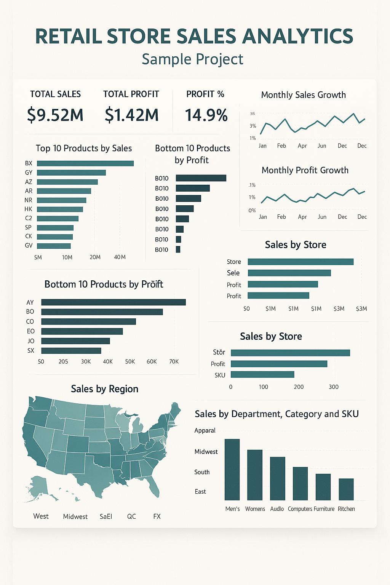

# 👋 Nalin Kumar S – Power BI Developer

**Power BI Developer | Data Analytics | SQL | DAX**  
📍 India  
📧 **snalin2610@gmail.com**  
📱 **+91-9392145718**

---

## 🌐 About Me

I am a Power BI Developer with 2 years of experience in building interactive dashboards, designing data models, writing optimized DAX measures, and transforming data using Power Query.

I enjoy turning raw data into meaningful, visual stories that help stakeholders make better business decisions.

---

## 🛠 Tech Stack & Skills

### 🧩 Power BI
- Data Modeling (Star Schema, Snowflake, Relationships)
- DAX (KPIs, Time Intelligence – YTD, QTD, MTD)
- Power Query (Data Cleaning & Transformations)
- Bookmarks, Buttons, Page Navigation
- Row-Level Security (RLS)
- Power BI Service (Publishing, Workspaces, Scheduled Refresh, Gateway)

### 🗄 Databases & Tools
- SQL Server
- SQL (Joins, Aggregations, Window Functions)
- Excel (Lookups, Pivot Tables, Data Cleaning)

### 🎯 Strengths
- Dashboard Design & Storytelling
- Performance Optimization
- Requirement Gathering & Stakeholder Communication
- Problem Solving & Debugging

---

## 📊 Projects

### 1️⃣ TK Maxx – Sales Performance Dashboard (Real Project)

**Role:** Power BI Developer  
**Duration:** Oct 2023 – Oct 2025  
**Domain:** Retail – Apparel & Home Goods  
**Tools:** Power BI, SQL Server, Power Query  

**Objective:**  
To provide end-to-end visibility into sales, product performance, and store performance across different zones and locations for TK Maxx.

**Key Features:**
- Sales analysis by **Zone → Store → Category → Product**
- Trend analysis at **Daily, Weekly, Monthly, Quarterly, Yearly** levels
- Top & bottom performing stores and categories
- Geographic view of store performance (maps)
- Employee-level performance metrics
- Data refreshed on a schedule using Power BI Service

**My Contributions:**
- Understood business requirements and translated them into report designs
- Built an efficient data model and managed one-to-many and many-to-many relationships
- Created DAX measures for:
  - YTD, MTD, QTD calculations
  - Sales, Margin, Growth KPIs
  - Top N and dynamic ranking
- Performed data cleaning and transformation in Power Query
- Published reports to Power BI Service and configured scheduled refresh
- Provided support for enhancements and data/requirement changes

---

### 2️⃣ Retail Store Sales Analytics (Sample Project)

**Domain:** Retail  
**Tools:** Power BI, Excel  

**Objective:**  
Analyze overall retail performance across multiple stores and departments to identify revenue growth opportunities and underperforming areas.

**Key Highlights:**
- KPIs: **Total Sales, Total Profit, Profit %, Quantity Sold**
- Time intelligence: Month-over-Month (MoM) growth charts
- Top 10 & Bottom 10 products by sales and profit
- Store-wise performance comparison dashboard
- Customer segmentation by region and purchase behavior
- Drill-down from **Department → Category → SKU**

**What This Shows:**
- Ability to design a star-schema model
- Strong use of DAX for time intelligence and KPIs
- Dashboard layout focused on executive decision-making
- Experience in visual storytelling (from overview to detail)
### Retail Store Sales Analytics – Dashboard Preview

---

### 3️⃣ HR Analytics – Workforce & Attrition Dashboard (Sample Project)

**Domain:** HR Analytics  
**Tools:** Power BI  

**Objective:**  
Provide HR and management with insights on employee headcount, attrition, hiring trends, and workforce composition.

**Key Highlights:**
- Headcount tracking over time
- Overall attrition rate and department-wise attrition
- Hiring vs Exit trend chart
- Performance ratings by department/role
- Gender and age group diversity analysis
- Experience band distribution (0–2, 2–5, 5+ years)

**Advanced Concepts Used:**
- Row-Level Security (RLS) for department-level restricted views
- Drill-through pages to view employee-level metrics
- KPI cards for quick executive summary
- Custom tooltips for richer hover insights
### HR Analytics – Dashboard Preview

---

## 📌 How I Work

- Start with understanding the **business question** before building visuals
- Design a **clean and optimized data model** first
- Use **DAX & Time Intelligence** to build meaningful KPIs
- Focus on **simple, intuitive, and interactive** dashboards
- Validate numbers with stakeholders before finalizing

---

## 📄 Resume

My detailed resume is available on request via email:  
📧 **snalin2610@gmail.com**

---

## 📞 Contact

If you’d like to know more about my work or discuss an opportunity:

- 📧 **Email:** `snalin2610@gmail.com`  
- 📱 **Mobile:** `+91-9392145718`  
- 📍 **Location:** India  

Thank you for visiting my Power BI portfolio!

